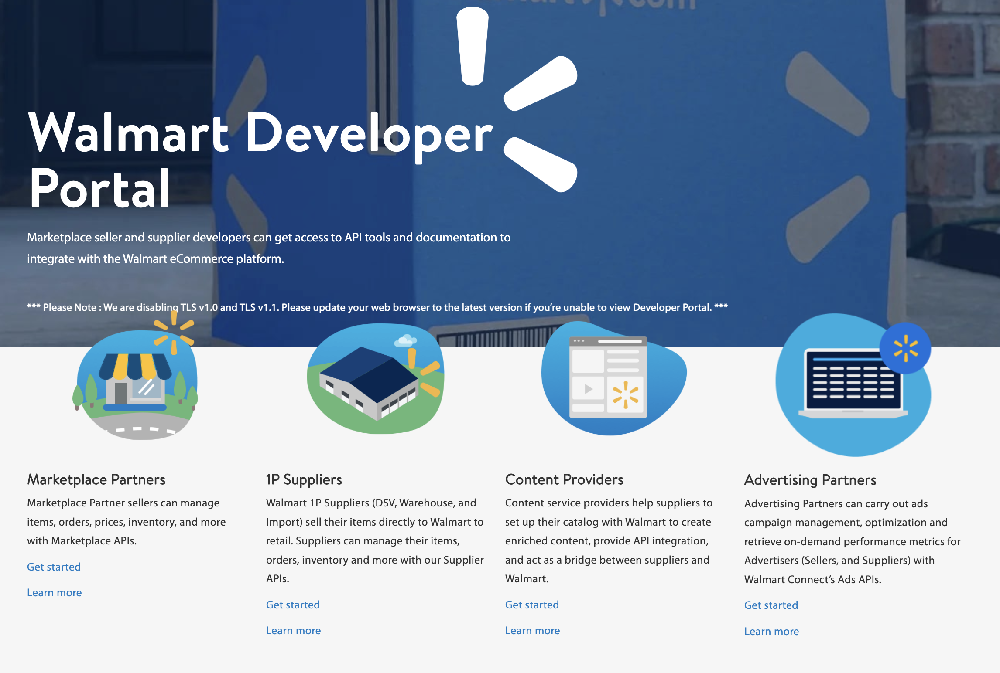

<div align="center">

[](https://developer.walmart.com&#x2F;)

# [Walmart](https://developer.walmart.com&#x2F;)

The content management feed allows you to process content for items in bulk. You can take in content via the content feeds. Use the XSDs to manage content.

</div>

## Requirements

Building the API client library requires:

1. Java 1.8+
2. Maven (3.8.3+)/Gradle (7.2+)

If you are adding this library to an Android Application or Library:

3. Android 8.0+ (API Level 26+)

## Installation<a id="installation"></a>
<div align="center">
  <a href="https://konfigthis.com/sdk-sign-up?company=Walmart&serviceName=Content%20Management&language=Java">
    
  </a>
</div>

### Maven users

Add this dependency to your project's POM:

```xml
<dependency>
  <groupId>com.konfigthis</groupId>
  <artifactId>walmart-content-management-java-sdk</artifactId>
  <version>1.0.0</version>
  <scope>compile</scope>
</dependency>
```

### Gradle users

Add this dependency to your `build.gradle`:

```groovy
// build.gradle
repositories {
  mavenCentral()
}

dependencies {
   implementation "com.konfigthis:walmart-content-management-java-sdk:1.0.0"
}
```

### Android users

Make sure your `build.gradle` file as a `minSdk` version of at least 26:
```groovy
// build.gradle
android {
    defaultConfig {
        minSdk 26
    }
}
```

Also make sure your library or application has internet permissions in your `AndroidManifest.xml`:

```xml
<!--AndroidManifest.xml-->
<?xml version="1.0" encoding="utf-8"?>
<manifest xmlns:android="http://schemas.android.com/apk/res/android"
    xmlns:tools="http://schemas.android.com/tools">
    <uses-permission android:name="android.permission.INTERNET"/>
</manifest>
```

### Others

At first generate the JAR by executing:

```shell
mvn clean package
```

Then manually install the following JARs:

* `target/walmart-content-management-java-sdk-1.0.0.jar`
* `target/lib/*.jar`

## Getting Started

Please follow the [installation](#installation) instruction and execute the following Java code:

```java
import com.konfigthis.client.ApiClient;
import com.konfigthis.client.ApiException;
import com.konfigthis.client.ApiResponse;
import com.konfigthis.client.Walmart;
import com.konfigthis.client.Configuration;
import com.konfigthis.client.auth.*;
import com.konfigthis.client.model.*;
import com.konfigthis.client.api.FeedsApi;
import java.util.List;
import java.util.Map;
import java.util.UUID;

public class Example {
  public static void main(String[] args) {
    Configuration configuration = new Configuration();
    configuration.host = "http://localhost";
    
    configuration.clientId  = "YOUR API KEY";
    
    configuration.privateKey  = "YOUR API KEY";
    Walmart client = new Walmart(configuration);
    String feedType = "CONTENT_PRODUCT"; // The feed Type
    String WM_QOS_CORRELATION_ID = "b3261d2d-028a-4ef7-8602-633c23200af6"; // A unique ID which identifies each API call and used to track and debug issues; use a random generated GUID for this ID
    String WM_SVC_NAME = "Walmart Service Name"; // Walmart Service Name
    String WM_SEC_TIMESTAMP = "1443748249449"; // The Epoch timestamp
    String WM_SEC_AUTH_SIGNATURE = "9fg3TPeRt0WSGbXNGGj4kSQ9L6PMBX.....9Zj5aDyg="; // The vendor's digital signature, generated by running the JAR file or custom generation code
    String WM_CONSUMER_ID = "Get the Consumer ID from Developer Center after logging in"; // A unique ID required to access the API
    File _file = new File("/path/to/file"); // Feed file to upload
    String WM_CONSUMER_CHANNEL_TYPE = "WM_CONSUMER_CHANNEL_TYPE_example"; // A unique ID to track the consumer request by channel. Use the Consumer Channel Type received during onboarding
    try {
      FeedsCreateContentFeedResponse result = client
              .feeds
              .createContentFeed(feedType, WM_QOS_CORRELATION_ID, WM_SVC_NAME, WM_SEC_TIMESTAMP, WM_SEC_AUTH_SIGNATURE, WM_CONSUMER_ID, _file)
              .WM_CONSUMER_CHANNEL_TYPE(WM_CONSUMER_CHANNEL_TYPE)
              .execute();
      System.out.println(result);
      System.out.println(result.getFeedId());
    } catch (ApiException e) {
      System.err.println("Exception when calling FeedsApi#createContentFeed");
      System.err.println("Status code: " + e.getStatusCode());
      System.err.println("Reason: " + e.getResponseBody());
      System.err.println("Response headers: " + e.getResponseHeaders());
      e.printStackTrace();
    }

    // Use .executeWithHttpInfo() to retrieve HTTP Status Code, Headers and Request
    try {
      ApiResponse<FeedsCreateContentFeedResponse> response = client
              .feeds
              .createContentFeed(feedType, WM_QOS_CORRELATION_ID, WM_SVC_NAME, WM_SEC_TIMESTAMP, WM_SEC_AUTH_SIGNATURE, WM_CONSUMER_ID, _file)
              .WM_CONSUMER_CHANNEL_TYPE(WM_CONSUMER_CHANNEL_TYPE)
              .executeWithHttpInfo();
      System.out.println(response.getResponseBody());
      System.out.println(response.getResponseHeaders());
      System.out.println(response.getStatusCode());
      System.out.println(response.getRoundTripTime());
      System.out.println(response.getRequest());
    } catch (ApiException e) {
      System.err.println("Exception when calling FeedsApi#createContentFeed");
      System.err.println("Status code: " + e.getStatusCode());
      System.err.println("Reason: " + e.getResponseBody());
      System.err.println("Response headers: " + e.getResponseHeaders());
      e.printStackTrace();
    }
  }
}

```

## Documentation for API Endpoints

All URIs are relative to *http://localhost*

Class | Method | HTTP request | Description
------------ | ------------- | ------------- | -------------
*FeedsApi* | [**createContentFeed**](docs/FeedsApi.md#createContentFeed) | **POST** /v3/feeds | Content feeds
*FeedsApi* | [**createRichMediaFeed**](docs/FeedsApi.md#createRichMediaFeed) | **POST** /v2/feeds | Rich Media
*FeedsApi* | [**displayItemStatus**](docs/FeedsApi.md#displayItemStatus) | **GET** /feeds | Feed status
*FeedsApi* | [**getFeedStatus**](docs/FeedsApi.md#getFeedStatus) | **GET** /feeds/{feedId} | Feed item status


## Documentation for Models

 - [Cause](docs/Cause.md)
 - [FeedId](docs/FeedId.md)
 - [FeedRecord](docs/FeedRecord.md)
 - [FeedRecordResponse](docs/FeedRecordResponse.md)
 - [FeedRecordResponseErrorsInner](docs/FeedRecordResponseErrorsInner.md)
 - [FeedRecordResponseErrorsInnerCausesInner](docs/FeedRecordResponseErrorsInnerCausesInner.md)
 - [FeedRecordResponseResultsInner](docs/FeedRecordResponseResultsInner.md)
 - [FeedsCreateContentFeedRequest](docs/FeedsCreateContentFeedRequest.md)
 - [FeedsCreateContentFeedResponse](docs/FeedsCreateContentFeedResponse.md)
 - [FeedsCreateRichMediaFeedResponse](docs/FeedsCreateRichMediaFeedResponse.md)
 - [FeedsDisplayItemStatusResponse](docs/FeedsDisplayItemStatusResponse.md)
 - [FeedsGetFeedStatusResponse](docs/FeedsGetFeedStatusResponse.md)
 - [GatewayError](docs/GatewayError.md)
 - [IngestionError](docs/IngestionError.md)
 - [IngestionErrors](docs/IngestionErrors.md)
 - [IngestionErrorsIngestionErrorInner](docs/IngestionErrorsIngestionErrorInner.md)
 - [ItemDetails](docs/ItemDetails.md)
 - [ItemDetailsItemIngestionStatusInner](docs/ItemDetailsItemIngestionStatusInner.md)
 - [ItemDetailsItemIngestionStatusInnerIngestionErrors](docs/ItemDetailsItemIngestionStatusInnerIngestionErrors.md)
 - [PartnerFeedResponse](docs/PartnerFeedResponse.md)
 - [PartnerFeedResponseItemDetails](docs/PartnerFeedResponseItemDetails.md)
 - [PartnerItemIngestionStatus](docs/PartnerItemIngestionStatus.md)


## Author
This Java package is automatically generated by [Konfig](https://konfigthis.com)
